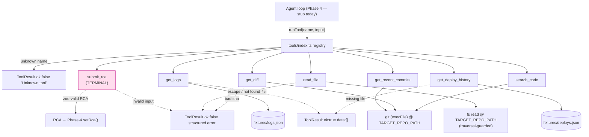

# responder — architecture notes

## Ingest flow (`src/ingest/`)

`POST /api/incidents` ([incidents.controller.ts](src/ingest/incidents.controller.ts)):

1. Validate the body against `ErrorEvent` (`@sre/shared`) — every field must be
   a non-empty string. Invalid → `400`, nothing touches the DB.
2. Fingerprint the event ([fingerprint.ts](src/ingest/fingerprint.ts)).
3. `findByFingerprint` → `createIncident`. These two calls **must stay
   synchronous** (both are `better-sqlite3`, which is sync). Inserting an
   `await` between them opens a race window: two concurrent requests for the
   same new error both miss the find, both try to create, and the second hits
   the `fingerprint UNIQUE` constraint as an unhandled 500. If either call ever
   needs to become async, the pair needs a transaction or a lock, not a plain
   await.
4. Existing fingerprint → `bumpCount`, reply `202` with the existing id.
   New fingerprint → `createIncident` (`status: investigating`), reply `202`,
   then kick off the agent loop.

### Why `setImmediate`, not `queueMicrotask`, to start the loop

The loop start is deliberately scheduled with `setImmediate` and wrapped in
`try/catch`:

- Microtasks run *before* the response is flushed to the socket. A
  microtask-scheduled loop start with any sync-heavy work would still delay
  the reply. `setImmediate` runs after I/O, so the `202` actually goes out
  first.
- A throw inside a bare `queueMicrotask` callback becomes an uncaught
  exception and crashes the process. Harmless while `startInvestigation` is a
  `console.log` stub — real danger once Phase 4 drops in the actual agent
  loop. The `try/catch` logs the failure instead of taking the server down.

## Fingerprinting (`src/ingest/fingerprint.ts`)

`fingerprint(event) = sha256(normalize(message) + "\n" + top-3 stack frames)`.

Goal: the *same* crash produces the *same* fingerprint every time, so repeats
dedupe onto one incident instead of spawning new ones on every hit.

- `normalize(message)` strips the parts of an error message that vary run to
  run without changing what broke: absolute paths (collapsed to basename),
  UUIDs, hex addresses, and line/column numbers. Order matters — paths are
  stripped before numbers so a `:line:col` embedded in a path is removed as
  part of the path, not left dangling.
- `parseFrames(stack, limit=3)` extracts the top stack frames as
  `file:function` (e.g. `users.service.ts:getUser`). Handles both V8 stack
  line shapes: `at fn (location)` and bare `at location` (anonymous frames
  fall back to `<anon>`).
- No wall-clock, no randomness anywhere in the pipeline — a restart or a
  redeploy must not change a fingerprint for the same input.

## Agent loop stub (`src/agent/loop.ts`)

`startInvestigation(incidentId)` is currently a stub — logs and returns. It
exists now so the ingest controller has a stable call site. Phase 4 replaces
the body with the real Anthropic tool-use loop; **the exported signature must
not change**, so the swap is a drop-in with no controller edits.

## Agent tools (`src/agent/tools/`)

Seven tools, each a file exporting `{ schema, execute }` (`Tool` in
`types.ts`), assembled by the registry (`index.ts`) that Phase 4's loop will
drive. Built and unit-tested standalone in Phase 3 — the loop does not call
into this package yet.

- **Contract:** `schema` is a native `Anthropic.Tool` (name, description,
  `input_schema`); `execute(input)` always resolves to a `ToolResult` —
  `{ ok: true, data }` or `{ ok: false, error }`. **Tools never throw.** A
  crashing tool would take down the whole investigation, so a missing file, a
  bad git sha, or a path-traversal attempt all become a structured
  `ok:false` the model can read and try again from.
- **Fixtures (`fixtures.ts`):** `get_logs` and `get_deploy_history` read
  `fixtures/logs.json` / `fixtures/deploys.json`. The path is built from
  `import.meta.url`, not `process.cwd()`, because both `src/agent/tools/` (dev,
  under `tsx`) and `dist/agent/tools/` (prod, after `tsc`) sit the same three
  levels under the responder root — one relative URL covers both, no
  build-copy step needed.
- **`read_file` / `search_code` traversal guard:** every path is resolved
  against `TARGET_REPO_PATH` and rejected if it escapes that root (e.g.
  `../../../etc/passwd`) before any `fs` call. `search_code` shells `git grep
  -n -F` (fixed-string, no regex injection); a `git grep` exit code of `1`
  means "no matches," which is a valid empty result, not an error.
- **`get_recent_commits` / `get_diff`:** shell `git log` / `git show` against
  `TARGET_REPO_PATH` via `execFile` (args as an array — no shell string, so a
  hostile sha can't inject a command).
- **`submit_rca` is terminal by name.** The tool itself only validates the
  `RCA` shape (zod) and echoes it back — it doesn't end anything. The registry
  exports `TERMINAL_TOOL = 'submit_rca'`; Phase 4's loop checks the tool name
  it just ran against that constant and, on success, persists the RCA and
  marks the incident resolved.
- **Registry (`index.ts`):** builds `toolSchemas` (fed to the Anthropic
  Messages API `tools` param) and `registry` (name → `Tool`) from each tool's
  own `schema.name` — one source of truth, so a renamed tool can't drift
  between the two. `runTool(name, input)` is the single dispatch point; an
  unknown tool name returns a structured error instead of throwing, so a model
  hallucinating a tool name doesn't crash the loop.
- **New deps this phase:** `@anthropic-ai/sdk` (types `schema` as
  `Anthropic.Tool`, so a shape mismatch is a compile error) and `zod`
  (runtime input validation — no library existed for this before).

