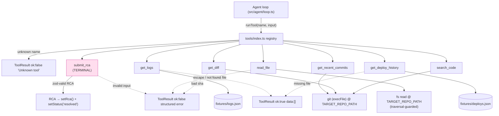

# responder — architecture notes

## Ingest flow (`src/ingest/`)

`POST /api/incidents` ([incidents.controller.ts](src/ingest/incidents.controller.ts)):

1. Validate the body against `ErrorEvent` (`@sre/shared`) — every field must be
   a non-empty string. Invalid → `400`, nothing touches the DB.
2. Fingerprint the event ([fingerprint.ts](src/ingest/fingerprint.ts)).
3. `findByFingerprint` → `createIncident`. These two calls **must stay
   synchronous** (both are `better-sqlite3`, which is sync). Inserting an
   `await` between them opens a race window: two concurrent requests for the
   same new error both miss the find, both try to create, and the second hits
   the `fingerprint UNIQUE` constraint as an unhandled 500. If either call ever
   needs to become async, the pair needs a transaction or a lock, not a plain
   await.
4. Existing fingerprint → `bumpCount`, reply `202` with the existing id.
   New fingerprint → `createIncident` (`status: investigating`), reply `202`,
   then kick off the agent loop.

### Why `setImmediate`, not `queueMicrotask`, to start the loop

The loop start is deliberately scheduled with `setImmediate` and wrapped in
`try/catch`:

- Microtasks run *before* the response is flushed to the socket. A
  microtask-scheduled loop start with any sync-heavy work would still delay
  the reply. `setImmediate` runs after I/O, so the `202` actually goes out
  first.
- A throw inside a bare `queueMicrotask` callback becomes an uncaught
  exception and crashes the process. Harmless while `startInvestigation` is a
  `console.log` stub — real danger once Phase 4 drops in the actual agent
  loop. The `try/catch` logs the failure instead of taking the server down.

## Fingerprinting (`src/ingest/fingerprint.ts`)

`fingerprint(event) = sha256(normalize(message) + "\n" + top-3 stack frames)`.

Goal: the *same* crash produces the *same* fingerprint every time, so repeats
dedupe onto one incident instead of spawning new ones on every hit.

- `normalize(message)` strips the parts of an error message that vary run to
  run without changing what broke: absolute paths (collapsed to basename),
  UUIDs, hex addresses, and line/column numbers. Order matters — paths are
  stripped before numbers so a `:line:col` embedded in a path is removed as
  part of the path, not left dangling.
- `parseFrames(stack, limit=3)` extracts the top stack frames as
  `file:function` (e.g. `users.service.ts:getUser`). Handles both V8 stack
  line shapes: `at fn (location)` and bare `at location` (anonymous frames
  fall back to `<anon>`).
- No wall-clock, no randomness anywhere in the pipeline — a restart or a
  redeploy must not change a fingerprint for the same input.

## Agent loop (`src/agent/loop.ts`)

`startInvestigation(incidentId)` stays a **sync `void`** export — the ingest
controller calls it inside a synchronous `try/catch`, which cannot catch a
rejected promise. The real work happens in an internal async
`runInvestigation(incidentId, opts)`; `startInvestigation` fires it and
attaches its own `.catch` so a crash mid-investigation marks the incident
`failed` instead of taking the process down. `opts` (client, maxSteps,
timeoutMs, tokenBudget) exists purely so tests can inject a fake Anthropic
client and shrink the caps — production always uses the defaults.

The loop is a standard Anthropic Messages API tool-use round trip: seed a
user message from `buildIncidentBriefing` (title, firstSeen, count, plus the
persisted `ErrorEvent`'s stack/route — see below), pass `tools: toolSchemas`,
and for each `tool_use` block call `runTool(name, input)` (never throws) and
feed the `ToolResult` back as a `tool_result` block (`is_error: !result.ok`).
`submit_rca` is terminal **by name**: when `runTool` returns `ok` for
`TERMINAL_TOOL`, that payload *is* the `RCA` — `setRca` + `setStatus(id,
'resolved')`, publish `rca` then `done`, stop. Two independent caps bound
runaway investigations: `MAX_STEPS` (12) and a 90s wall-clock `TIMEOUT_MS`
checked once per turn; either one exhausting calls `giveUp()` →
`setStatus(id, 'failed')` + a `failed` bus event + `done`.

### The `record()` invariant — persist and publish, always together

Every `AgentStep` (`thinking`, `tool_call`, `tool_result`) is created through
exactly one function:

```ts
function record(step: Omit<AgentStep, 'index'>): AgentStep {
  const index = appendStep(step as AgentStep); // DB assigns the monotonic idx
  const full: AgentStep = { ...step, index };
  publish(step.incidentId, { kind: 'step', step: full });
  return full;
}
```

There is no other way to emit a step. This is what guarantees "every agent
step must be persisted **and** emitted over SSE; never a silent step" — a
step that only hit one side would either leave a gap in the live feed or
vanish from history on replay.

### Richer briefing — the persisted `ErrorEvent`

`incidents` gained an `error_event_json` column (nullable, migrated in-place
in `db.ts` for pre-existing local `data.db` files via a `try { ALTER TABLE
... } catch {}`, since `CREATE TABLE IF NOT EXISTS` only helps a fresh DB).
`createIncident` now takes the validated `ErrorEvent` and stores it;
`getErrorEvent(id)` reads it back. The loop passes it into
`buildIncidentBriefing` so the model sees the real stack trace and route, not
just the 120-char title.

## Event bus (`src/events/incident-bus.ts`)

Pure in-process pub/sub, one channel (a `Set<Listener>`) per incident id,
kept in a `Map`. `publish` is a no-op if nobody is subscribed — it does
**not** buffer history, deliberately: history lives in SQLite via
`appendStep`/`listSteps`, and a bus that also remembered old messages would
double-deliver them to a late-joining SSE client. `subscribe` returns an
unsubscribe function that deletes the listener and, once a channel's set is
empty, deletes the channel entry too — no listener leaks across
investigations.

## SSE streaming (`src/ingest/stream.controller.ts`)

`GET /api/incidents/:id/stream` hijacks the Fastify reply
(`reply.hijack()`) and writes SSE frames directly to `reply.raw` — required
because we're holding the connection open past the handler's return, which
Fastify's normal response lifecycle doesn't expect.

The late-join race — a step published in the gap between "read stored steps"
and "subscribe to the bus" — is closed by **subscribing before reading
anything**: the bus listener buffers incoming messages until replay
finishes, then the buffer is flushed and dispatch goes live. A
`lastSentIdx` cursor de-dupes across the replay/buffer boundary, since a step
already sent during replay might also arrive again in the buffer if it was
published in that exact window.

Connecting after the incident is already `resolved`/`failed` skips the live
phase entirely: replay stored steps, replay the terminal event (`rca` if
present), send `done`, close. `request.raw.on('close', cleanup)` unsubscribes
on client disconnect so an abandoned connection doesn't leak a bus listener.

## Agent tools (`src/agent/tools/`)

Seven tools, each a file exporting `{ schema, execute }` (`Tool` in
`types.ts`), assembled by the registry (`index.ts`) and driven by the agent
loop (`src/agent/loop.ts`).

- **Contract:** `schema` is a native `Anthropic.Tool` (name, description,
  `input_schema`); `execute(input)` always resolves to a `ToolResult` —
  `{ ok: true, data }` or `{ ok: false, error }`. **Tools never throw.** A
  crashing tool would take down the whole investigation, so a missing file, a
  bad git sha, or a path-traversal attempt all become a structured
  `ok:false` the model can read and try again from.
- **Fixtures (`fixtures.ts`):** `get_logs` and `get_deploy_history` read
  `fixtures/logs.json` / `fixtures/deploys.json`. The path is built from
  `import.meta.url`, not `process.cwd()`, because both `src/agent/tools/` (dev,
  under `tsx`) and `dist/agent/tools/` (prod, after `tsc`) sit the same three
  levels under the responder root — one relative URL covers both, no
  build-copy step needed.
- **`read_file` / `search_code` traversal guard:** every path is resolved
  against `TARGET_REPO_PATH` and rejected if it escapes that root (e.g.
  `../../../etc/passwd`) before any `fs` call. `search_code` shells `git grep
  -n -F` (fixed-string, no regex injection); a `git grep` exit code of `1`
  means "no matches," which is a valid empty result, not an error.
- **`get_recent_commits` / `get_diff`:** shell `git log` / `git show` against
  `TARGET_REPO_PATH` via `execFile` (args as an array — no shell string, so a
  hostile sha can't inject a command).
- **`submit_rca` is terminal by name.** The tool itself only validates the
  `RCA` shape (zod) and echoes it back — it doesn't end anything. The registry
  exports `TERMINAL_TOOL = 'submit_rca'`; Phase 4's loop checks the tool name
  it just ran against that constant and, on success, persists the RCA and
  marks the incident resolved.
- **Registry (`index.ts`):** builds `toolSchemas` (fed to the Anthropic
  Messages API `tools` param) and `registry` (name → `Tool`) from each tool's
  own `schema.name` — one source of truth, so a renamed tool can't drift
  between the two. `runTool(name, input)` is the single dispatch point; an
  unknown tool name returns a structured error instead of throwing, so a model
  hallucinating a tool name doesn't crash the loop.
- **New deps this phase:** `@anthropic-ai/sdk` (types `schema` as
  `Anthropic.Tool`, so a shape mismatch is a compile error) and `zod`
  (runtime input validation — no library existed for this before).



## PR service (`src/git/`)

`POST /api/incidents/:id/pr` ([pr.controller.ts](src/git/pr.controller.ts) →
[pr.service.ts](src/git/pr.service.ts)) is **human-triggered, not an agent
tool** — the dashboard's "Open PR" button calls it after a human reviews the
RCA. Only callable once `rca` exists on the incident.

Sequence, all against the local clone at `TARGET_REPO_PATH` (a separate
`demo-app` repo, `TARGET_REPO` = `owner/repo`):

1. `git fetch origin main` + `git checkout -B sre/incident-<id8> origin/main`
   — always branches from a fresh copy of base; `-B` makes re-runs safe.
2. Write `rca.proposed_patch` to a temp file, `git apply --check` (dry run)
   then `git apply` for real. Failure at either step restores `main` and
   throws `PatchApplyError` **before** any commit or push — "nothing
   pushed" holds structurally, not by convention.
3. `git commit` referencing the incident id, suspect commit, and confidence.
4. `git push -u origin <branch> --force-with-lease`.
5. Octokit `pulls.create({ base: main, head: branch, body: rca.postmortem_md
   })` — the **only** GitHub API call in the whole flow; everything else is a
   real `git` subprocess, matching the pattern in
   [git-read.ts](src/agent/tools/git-read.ts).

Status codes: `201` created (`{url, branch, number}`), `400` no RCA yet,
`404` unknown incident, `409` patch failed to apply (git's own error
surfaced in the body), `502` push/GitHub failure after a successful apply.

### C3 patch contract

[fixtures/example-patch.diff](fixtures/example-patch.diff) is one worked
example of what `submit_rca`'s `proposed_patch` must look like for this
service to accept it — a `git apply`-compatible unified diff. Guarded by
[example-patch.test.ts](src/git/example-patch.test.ts), which fails loudly if
the fixture ever drifts out of an applyable shape.
